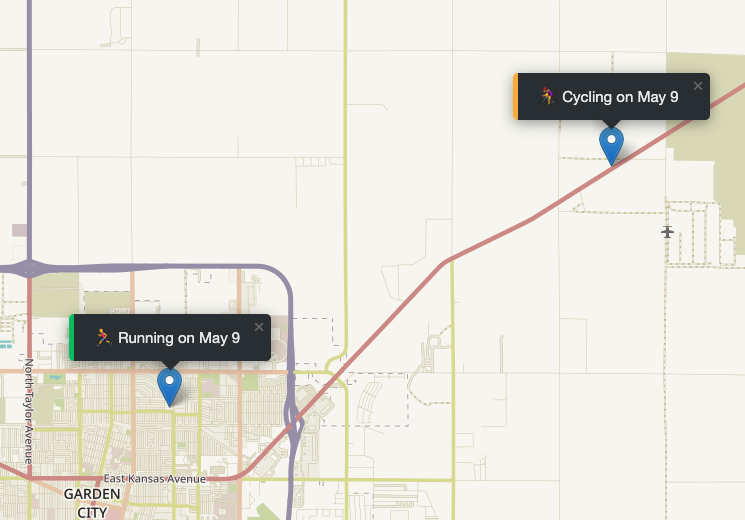

# 🗺️ Mapty App

A geolocation-based workout tracker for running and cycling — built with HTML, CSS, JavaScript, and Leaflet.js.


---

## 📍 Description

Mapty App is an interactive, location-based workout tracking application built with JavaScript using Object-Oriented Programming (OOP) principles. It leverages browser Geolocation, the Leaflet.js mapping library, and local storage to provide a seamless user experience for logging<br> running and cycling workouts directly on a map.

This project allowed me to explore and apply several core web development concepts, including:<br>
-	📌 Geolocation API: Automatically fetches the user’s current location to center the map and allow spatial workout logging.<br><br>
-	🗺️ Leaflet.js: Renders an interactive map where users can click to create workout markers with dynamic popups.<br><br>
-	⚙️ Dynamic Forms: A context-aware input form is rendered upon map interaction, allowing users to input detailed workout data—such as<br> distance (km), duration (minutes), and cadence (steps/min) for running, or elevation gain (meters) for cycling.<br><br>
-	📆 Workout Rendering: Each workout displays as a marker with a styled popup showing the workout type, date, and icon. Color-coded UI<br> enhancements help visually distinguish between workout types.<br><br>
-	🧠 OOP Architecture: The app is designed using classes and encapsulation, separating concerns between the workout logic, map interaction,<br> and user interface rendering.<br><br>
-	♻️ Local Storage: Ensures workouts persist across page reloads, preserving user data without the need for a backend.<br><br>

Additionally, the project includes architectural diagrams and a flowchart (provided as .png files) to illustrate the app’s structure and logic.

## 📑 Table of Contents

- [🔗 Links](#🔗-links)
- [📸 Screenshots](#📸-screenshots)
- [🛠️ Installation](#🛠️-installation)
- [🚀 Usage](#🚀-usage)
- [💡 Features](#💡-features)
- [📈 Technologies Used](#📈-technologies-used)
- [🏅 Badges](#🏅-badges)
- [🔌 APIs Used](#🔌-apis-used)
- [🙌 Credits](#🙌-credits)
- [🧾 License](#🧾-license)

## 🔗 Links

- 🌍 **Live Demo:** [Mapty App](https://garciajv86.github.io/Mapty/)
- 📂 **Source Code:** [GitHub Repository](https://github.com/garciajv86/Mapty)
- 🧠 **Project Diagrams:** [`Architecture Part 1`](./assets/images/Mapty-architecture-part-1.png), [`Final Architecture`](./assets/images/Mapty-architecture-final.png), [`Flowchart`](./assets/images/Mapty-flowchart.png)

## 📸 Screenshots

### 🗺️ Map Interface with Workout Popup


### 📝 Workout Form
<br><br>


### 📋 Logged Workouts List


## 🛠️ Installation

No installation is required.

This is a fully client-side web application. Simply **open the `index.html` file in your browser**, or visit the **live demo link** to start using the app instantly.

> ✅ Note: For full functionality (like geolocation), the app should be served via `https` or opened from `localhost`. Opening directly from the file system (`file://`) may restrict some browser features.

---

### 🔧 Run Locally

1. **Clone the repository:**
   ```bash
   git clone https://github.com/garciajv86/Mapty.git

2. Navigate to the project folder and either:
   - Open the index.html file in your browser, or
   - Use a local development server (like VS Code’s Live Server extension).

💡 Tip: To ensure browser APIs like the Geolocation API work correctly, use a local server (e.g., Live Server) rather than opening the file directly (file://). These features typically require access over http or https.

## 🚀 Usage

1. **Open the Mapty App in your browser.**

   When the app loads, it will request access to your current location using the **Geolocation API**. If permission is granted, the **Leaflet map** will center on your position.

2. **Click on the map** where you performed a workout.

   This will trigger a form to appear, allowing you to log a workout at that specific location.

3. **Choose a workout type** from the dropdown:
   - 🏃‍♂️ **Running**: Enter distance (km), duration (min), and cadence (steps/min).
   - 🚴‍♀️ **Cycling**: Enter distance (km), duration (min), and elevation gain (meters).

4. **Submit the workout form by pressing enter.**

   A workout marker will be added to the map at the clicked location. A custom popup will appear showing:
   - Workout type (with an icon)
   - Date (e.g., “Running on May 9”)
   - Custom color-coded marker with a decorative border

5. **View workouts in the sidebar list.**

   All workouts are rendered in a sidebar. Clicking a workout in the list will pan and zoom the map to the associated marker.

6. **Data Persistence:**

   All workout data is saved using the **Web Storage API (localStorage)**. This ensures that your workouts remain on the map even after refreshing or closing the browser.

---

### 📌 Notes
- Currently, units are in **kilometers** and **meters**, but future updates will include an option to switch to **miles** and **feet**.
- This app is designed for **desktop and modern browsers**.

🔗 **Live Demo:** [Click to try Mapty App](https://garciajv86.github.io/Mapty/)

## 💡 Features
-	Log running and cycling workouts by clicking on a map
-	Display a custom form depending on the selected workout type
-	Dynamic map markers and animated map movements
-	Intuitive user interface with conditional rendering
-	Persistent data storage via localStorage
-	Custom UI styling including border indicators for workout types
-	Modular, refactored codebase adhering to clean architecture principles

## 📈 Technologies Used
-	JavaScript (ES6+)
-	HTML5 & CSS3
-	Leaflet.js
-	Geolocation API
-	Web Storage API (localStorage)
-	Visual planning tools (architecture diagrams, flowcharts)

## 🙌 Credits

<br>
[Jonas Schmedtmann](https://x.com/jonasschmedtman) – Original course instructor and project designer. This project was built as part of his “The Complete JavaScript Course” curriculum.<br><br>
 <br>
[Joshua V. Garcia](https://github.com/garciajv86) – Developer and implementer of this version of the project, with additional customizations and enhancements.

## 🧾 License


This project is licensed under the [MIT License](https://choosealicense.com/licenses/mit/).  
You are free to use, modify, and distribute this software with attribution.

## 🏅 Badges


### 🧱 Core Technologies

  
  


### 🧰 Browser APIs & Libraries

  
  


### 🧠 Architecture & Paradigms

  


### 📦 Project Info

  
  


## 🔌 APIs Used

This project utilizes the following APIs and external libraries:

📍 Geolocation API
-	Description: A built-in browser API that retrieves the user’s current geographic location.
-	Usage in Project: Used to center the map on the user’s current location at app startup.
-	Documentation: [MDN Web Docs - Geolocation API](https://developer.mozilla.org/en-US/docs/Web/API/Geolocation_API)

⸻

🗺️ Leaflet.js
-	Description: A modern, open-source JavaScript library for mobile-friendly interactive maps.
-	Usage in Project: Used to render the map, handle user interactions like clicks, and display dynamic workout markers with popups.
-	Documentation: [Leaflet.js Documentation](https://leafletjs.com/reference.html)

⸻

💾 Web Storage API (localStorage)
-	Description: A part of the Web Storage API that allows websites to store key/value pairs in a user’s browser with no expiration time.
-	Usage in Project: Used to store and retrieve workout data to maintain state between sessions.
-	Documentation: [MDN Web Docs - Web Storage API](https://developer.mozilla.org/en-US/docs/Web/API/Window/localStorage)